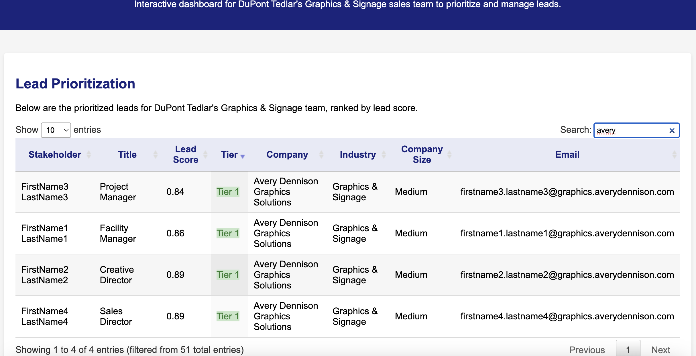

# DuPont Tedlar Sales Lead Generation System

This project is an AI-powered sales lead generation system for DuPont Tedlar's Graphics & Signage team. It automates the process of identifying potential customers from industry events (specifically ISA Sign Expo 2025), finding key decision-makers, evaluating lead quality, and generating personalized outreach messages.

## Features

- **Real Event Data Collection**: Collects real company data from ISA Sign Expo 2025
- **Company Prioritization**: Identifies and prioritizes companies based on relevance to DuPont Tedlar's Graphics & Signage solutions
- **Stakeholder Identification**: Locates key decision-makers at target companies
- **Lead Scoring & Qualification**: Evaluates and ranks potential leads based on multiple criteria, with detailed qualification reasoning
- **Personalized Outreach**: Generates tailored messages for each stakeholder based on company profile and needs
- **Interactive Dashboard**: Visualizes results in an easy-to-use format with expandable company details and outreach messages

## Installation

1. Clone this repository
2. Install dependencies:
   ```
   pip install -r requirements.txt
   ```
3. Create a `.env` file in the root directory with your API keys (see `.env.example` for format) --for future work

## Usage

Run the main program:

```
python run_pipeline.py
```

This will:
1. Collect real company data from [ISA Sign Expo 2025](https://isasignexpo2025.mapyourshow.com/8_0/#/searchtype/keyword/search/graphics/show/all)
2. Enrich company information with additional details
3. Find key stakeholders at each company
4. Score and qualify leads based on relevance to DuPont Tedlar
5. Generate personalized outreach messages for each stakeholder (future work)
6. Create and open an interactive dashboard with prioritized leads

## Project Structure

- `src/`: Source code
  - `config/`: Configuration files
  - `data_collection/`: Modules for collecting event and company data
    - `isa_expo_companies.py`: Real company data from ISA Sign Expo 2025
  - `data_enrichment/`: Modules for enriching company and stakeholder data
  - `lead_scoring/`: Lead evaluation and prioritization
  - `outreach/`: Personalized message generation
  - `visualization/`: Dashboard generation
- `data/`: Data storage
  - `raw/`: Raw collected data
  - `processed/`: Intermediate processed data
  - `output/`: Final output data and dashboard
- `tests/`: Test files

## Dashboard Features

- **Lead Prioritization Table**: Sortable and filterable table of all leads with tier classification
- **Company Details**: Expandable sections showing company information and qualification reasoning
- **Personalized Outreach**: Pre-generated outreach messages tailored to each stakeholder
- **Data Visualization**: Charts showing lead distribution by industry, company size, and qualification tier

### Screenshots

Below is screenshot of the Avery Dennison demo:


*Example of qualified lead details for Avery Dennison Graphics Solutions*

## Integration Possibilities (Future Work)

The system can further be integrated with:
- LinkedIn Sales Navigator API for enhanced stakeholder identification
- Clay API for contact information enrichment
- CRM systems (Salesforce, HubSpot) for lead management and tracking
- Email automation tools for outreach campaign execution

## License

This project is proprietary and confidential.